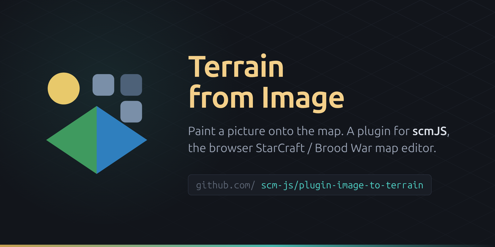

# Terrain from Image



A plugin for [scmJS](https://github.com/jeany55/scm-js), the browser-based StarCraft 1 /
Brood War map editor: it paints a picture onto the map.

Bring an image in (a file, Ctrl+V, a drop, or a URL), say where on the map it goes and how it
fits, tune it (auto-levels, brightness, contrast, gamma, saturation, hue, invert, blur), then
give each terrain a **key colour** — pick one straight out of the picture with the eyedropper —
and every cell becomes the terrain whose key colour is nearest. Apply is a single undo step.

The default match is isometric: the plugin paints lattice diamonds with the editor's ISOM brush,
low ground first and rare terrains last, so **cliffs and shores are generated** at the
boundaries rather than drawn. On a map with no `ISOM` section (or if you ask for tiles) it
stamps flat tile pairs instead.

## Install

In scmJS: **Plugins ▸ Manage Plugins…**, paste

```
https://github.com/scm-js/plugin-image-to-terrain
```

and press **Add**. It ships enabled by default, so it is normally already in that list — the
editor fetches it from here on startup.

To pin a version, add a ref: `github:scm-js/plugin-image-to-terrain@v1.0.0`.

## Use

- **File ▸ Import ▸ Terrain from Image…** — opens the dialog on the whole map.
- **Terrain from Image into Area…** — in the map's and the terrain palette's context menus;
  drag the target rectangle on the map first, then the dialog opens with it selected.

Settings and the per-tileset key colours are remembered between sessions.

## Layout

| | |
| --- | --- |
| `plugin.json` | the manifest the editor reads (name, version, `entry`, `icon`, the API version it needs) |
| `plugin.ts` | `activate(api)`: the dialog, the image sources, the eyedropper, the transaction |
| `convert.ts` | the pure part — colour adjustment, OKLab matching, majority filter, region cleanup, fit |
| `plugin-api/` | the editor's emitted type declarations, vendored so this repository type-checks alone |
| `tests/` | vitest over `convert.ts` |
| `.github/` | the repository's social preview card and the scm-js organisation avatar (both uploaded by hand — GitHub has no API for either) |

`plugin-api/` is generated in the editor's repository by `npm run build:plugin-types`; refresh it
from there when the plugin API version moves.

## Development

```sh
npm install
npm run typecheck
npm test
```

The editor loads plugins straight from source — it fetches `plugin.ts`, transpiles it in a worker
and imports it — so there is no build step here. To try local changes, serve this directory
(`npx serve .`) and add `http://localhost:3000/` in Manage Plugins, then use **Reload** after each
edit.

A plugin runs with the editor's own privileges. There is no sandbox.

See [`docs/plugins.md`](https://github.com/jeany55/scm-js/blob/main/docs/plugins.md) in the editor
for the API tour.

## Licence

MIT — see [LICENSE](LICENSE).
